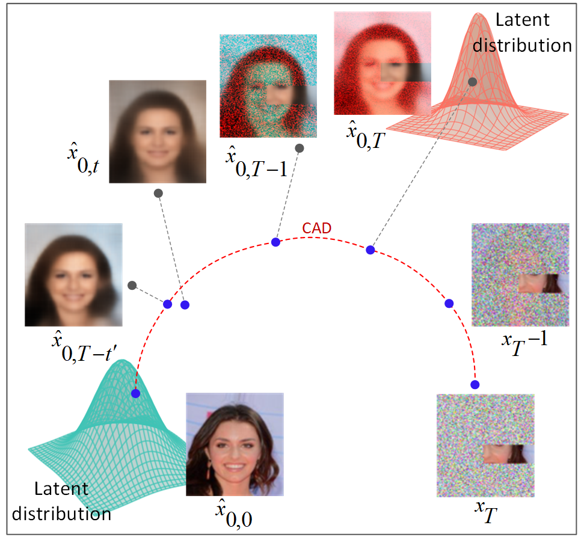

# From Missing Pieces to Masterpieces: Image Completion with Context-Adaptive Diffusion

This repository is the official implementation of **ConFill**. 

<td></td>

## Requirements
- python 3.10
- pytorch 2.2.1+cu121
- pytorch-lightning 2.2.1

This repository use code from [RePaint](https://github.com/andreas128/RePaint).

## Datasets

### CelebaHQ
Download the CelebaHQ dataset and extract it as:
```text
-CelebAMask-HQ/CelebA-HQ-img/
     |----1.jpg
     |----2.jpg
     ...
     |----3.jpg
```
### Imagenet1k
Download and prepare Imagenet1k dataset using `get_imagenet.sh``.
```text
imagenet1k/train
     |----n01440764/
          |----n01440764_1.JPEG
          ...          
     ...
imagenet1k/val
     |----n01440764/
          |----ILSVRC2012_val_00000293.JPEG
          ...     
     ...
```

### Places
Download Places2 dataset and samples the 2000 test files by copying the 2000 files from `splits/places_2000_filesnames_test.txt` to a directory of your choice.
